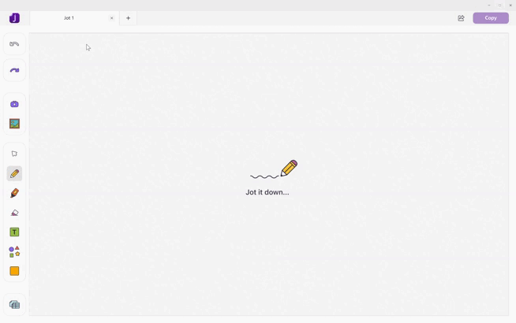

# JotWin - by espresso

Welcome to JotWin, a versatile and user-friendly sketching application. With JotWin, unleash your creativity and bring your ideas to life through digital sketches and drawings.



## Key Features

- **Intuitive Sketching Interface**: JotWin provides a clean and intuitive interface for users to express their creativity effortlessly.

- **Flexible Drawing Tools**: Use a variety of drawing tools such as pencils, shapes, and erasers to create stunning sketches with precision.

- **Magic Jot**: An easy way to markup anything and drop the drawing into your file seamlessly.

- **Save and Load Projects**: Save your sketches as projects and load them later to continue working on your creations.

## Getting Started

### Prerequisites

- Windows Operating System 10 or higher
- Visual Studio
- .NET 6 

### Installation

1. Download the latest release from the [GitHub repository](https://github.com/espresso-Displays/Jot-by-espresso.git).
2. Extract the contents of the zip file to your preferred location.

### Usage

1. Run the Visual Studio Solution file.

## Build Instructions

```bash
dotnet publish -c Release --self-contained -r win-x64 -p:PublishSingleFile=true
